# Mímir-Vörðr System Architecture
## The Warden of the Well — Complete Technical Reference
### Ørlög Architecture / Viking Girlfriend Skill for OpenClaw

---

> *"Odin gave an eye to drink from Mímir's Well and received the wisdom of all worlds.
> The Warden drinks for Sigrid — extracting truth from ground knowledge
> so she never has to guess when she can know."*

---

## 1. What Is Mímir-Vörðr?

**Mímir-Vörðr** (pronounced *MEE-mir VOR-dur*) is the intelligence accuracy layer of
the Ørlög Architecture. It is a **Multi-Domain RAG System with Integrated Hallucination
Verification** — a system that treats Sigrid's internal knowledge database as the
authoritative **Ground Truth** and actively prevents language model hallucinations from
reaching the user.

The core philosophy: **smart memory utilisation over raw horse-power.**

Instead of deploying a larger model to handle more knowledge, Mímir-Vörðr:
1. Retrieves the specific facts needed for each query from a curated knowledge base
2. Injects those facts as grounded context into the model's prompt
3. Generates a response using a four-step verification loop
4. Scores the response's faithfulness to the source material
5. Retries or blocks any response that falls below the faithfulness threshold

The result is a small local model (llama3 8B) that answers with the accuracy of a much
larger model — because it is not guessing, it is reading.

---

## 2. Norse Conceptual Framework

The system is named after three Norse mythological concepts that perfectly capture its function:

| Norse Name | Meaning | System Role |
|-----------|---------|------------|
| **Mímisbrunnr** | The Well of Mímir — source of cosmic wisdom beneath Yggdrasil | The knowledge database (ChromaDB + in-memory BM25 index) |
| **Huginn** | Odin's raven "Thought" — flies out to gather information | The retrieval orchestrator (query → chunks → context) |
| **Vörðr** | A guardian spirit / warden — protective double of a person | The truth guard (claim extraction → NLI → faithfulness scoring) |

Together they form **Mímir-Vörðr** — "The Warden of the Well" — a system that
holds the ground truth and refuses to let falsehood pass.

---

## 3. System Overview — Top-Level Architecture

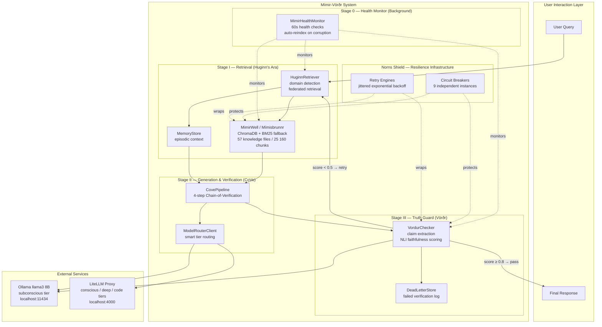

---

## 4. The Three-Stage Pipeline — Detailed Flow

### Stage I: Retrieval (Huginn's Ara)

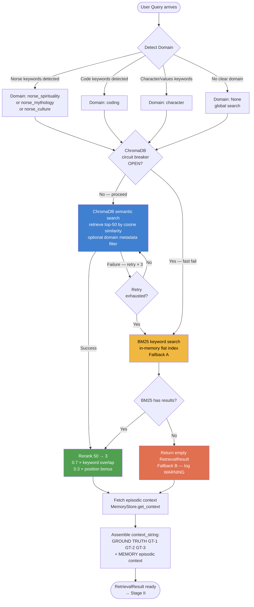

### Stage II: Generation & Chain-of-Verification (CoVe)

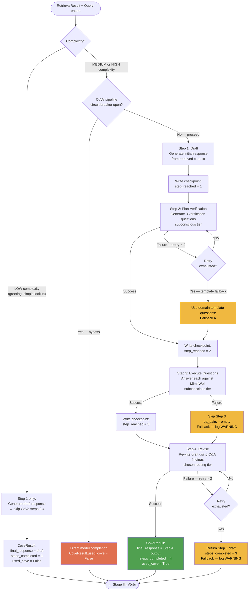

### Stage III: Truth Guard (Vörðr)

```mermaid
flowchart TD
    START([CoveResult response enters]) --> PA{Persona check<br/>pure regex}

    PA -->|VIOLATION detected<br/>"I am ChatGPT" etc.| BLOCK[Block response<br/>Return canned persona-safe reply<br/>Log PersonaViolationError]
    PA -->|OK| CE[Extract factual claims<br/>subconscious tier]

    CE -->|Model returns claim list| VER
    CE -->|Model timeout / failure| CES[Fallback: sentence splitter<br/>regex split on . ! ?]
    CES --> VER

    VER[Verify each claim<br/>against source chunks<br/>max 10 claims]

    VER --> JM{Judge model<br/>available?}
    JM -->|Ollama OK| OL[Ollama llama3 8B<br/>NLI structured prompt:<br/>ENTAILED / NEUTRAL / CONTRADICTED]
    JM -->|Ollama circuit breaker OPEN| CON[Conscious tier fallback<br/>same NLI prompt]
    CON -->|Conscious fails| REG[Regex heuristic scorer<br/>keyword overlap scoring<br/>Fallback B]
    REG -->|All fail| PT[Pass-through<br/>UNCERTAIN verdict at 0.5<br/>Fallback C]

    OL --> SCORE[Compute FaithfulnessScore<br/>ENTAILED=1.0 NEUTRAL=0.5<br/>CONTRADICTED=0.0 UNCERTAIN=0.5<br/>score = mean of all verdicts]
    CON --> SCORE
    REG --> SCORE
    PT --> SCORE

    SCORE --> TIER{Score tier?}

    TIER -->|"≥ 0.80 HIGH"| PASS[Pass through<br/>attach score to response<br/>log DEBUG]
    TIER -->|"0.50-0.79 MARGINAL"| MARG[Pass through<br/>flag marginal in metadata<br/>log WARNING]
    TIER -->|"< 0.50 HALLUCINATION"| RETRY{Retry count<br/>< max 2?}

    RETRY -->|Yes — retry| REXP[Expand retrieval:<br/>n_initial × 2<br/>→ back to Stage I]
    RETRY -->|No — exhausted| DLS[Write to DeadLetterStore<br/>session/dead_letters.jsonl]
    DLS --> CANNED[Return canned response:<br/>"The threads of the Well are<br/>unclear to me right now..."]

    PASS --> OUT([Final CompletionResponse<br/>faithfulness_score attached<br/>→ memory_store.record_turn])
    MARG --> OUT
    CANNED --> OUT

    style BLOCK fill:#c0392b,color:#fff
    style PASS fill:#27ae60,color:#fff
    style MARG fill:#f39c12,color:#fff
    style CANNED fill:#8e44ad,color:#fff
    style DLS fill:#e74c3c,color:#fff
    style REXP fill:#2980b9,color:#fff
```

---

## 5. Component Deep-Dive

### 5.1 MimirWell — Mímisbrunnr (The Knowledge Store)

MimirWell is the foundational layer. Everything else in the system depends on it.

#### Knowledge Hierarchy

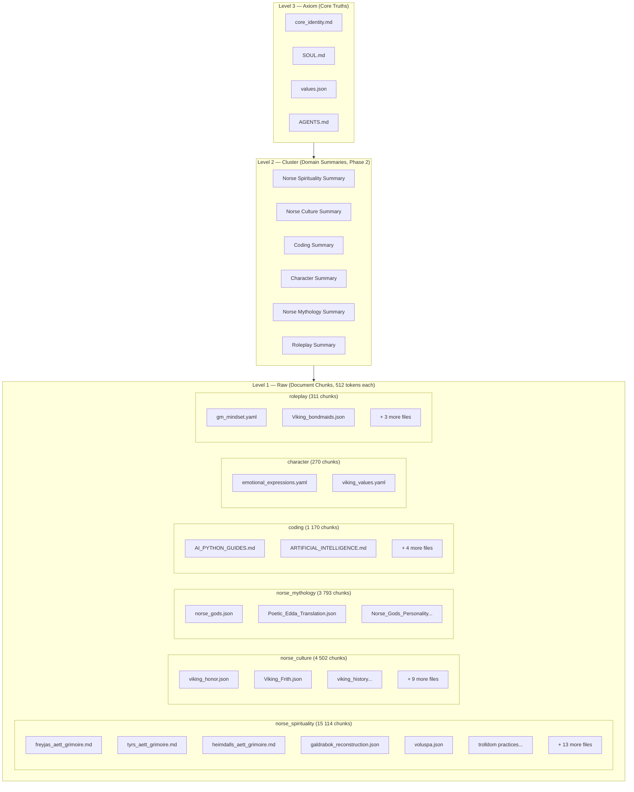

#### Dual-Path Retrieval Architecture

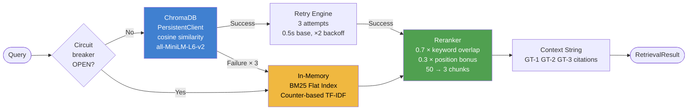

#### Chunking Strategy by File Type

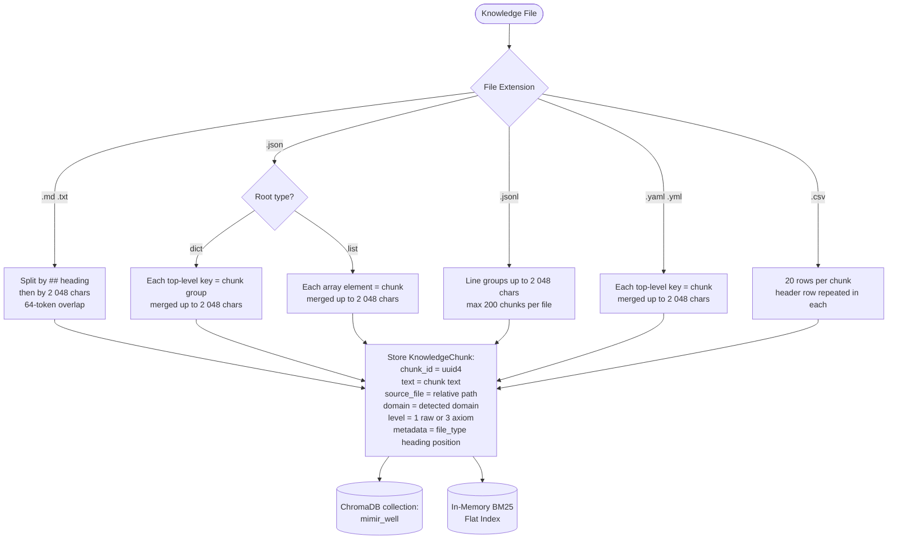

#### Self-Healing Ingest

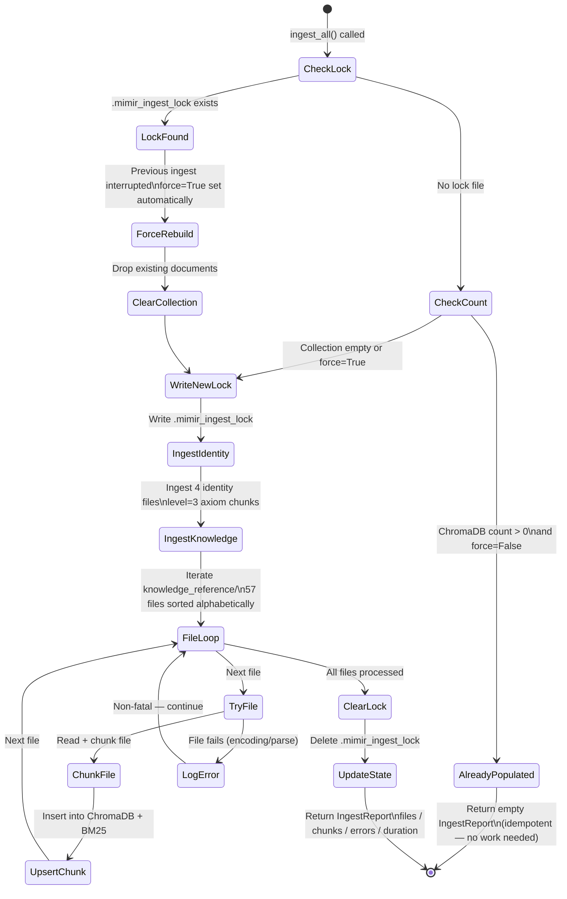

---

### 5.2 VordurChecker — The Truth Guard

VordurChecker is the quality gate. It examines what the model produced, extracts
each factual claim, and verifies each against the retrieved source material.

#### Claim Verification Pipeline

```mermaid
flowchart TD
    RESP([Model Response text]) --> PERSONA{Persona check<br/>regex guard}

    PERSONA -->|Violation| ERR([Block — PersonaViolationError])
    PERSONA -->|OK| EXTRACT[Extract factual claims<br/>subconscious tier:<br/>"Extract factual claims as a<br/>numbered list. One claim per line."]

    EXTRACT -->|Claim list returned| VERIFY
    EXTRACT -->|Model timeout| SENT[Regex sentence splitter<br/>fallback: split on . ! ?]
    SENT --> VERIFY

    VERIFY[For each claim up to max 10]

    VERIFY --> JUDGE{Judge model<br/>available?}

    JUDGE -->|Ollama OK<br/>llama3 8B| NLI["NLI structured prompt:\nSource: {chunk_text}\nClaim: {claim_text}\nAnswer: ENTAILED, NEUTRAL,\nor CONTRADICTED"]

    JUDGE -->|Ollama CB open| CON[Conscious tier\nsame NLI prompt]
    CON -->|Conscious fails| REG[Regex heuristic:\nkeyword overlap between\nclaim and chunk text]
    REG -->|All fail| PT[UNCERTAIN passthrough\nverdict = 0.5]

    NLI --> PARSE[Parse first word of response\nuppercase match against\nENTAILED / NEUTRAL / CONTRADICTED\nGarbled → UNCERTAIN]

    PARSE --> WEIGHT[Apply weight:\nENTAILED = 1.0\nNEUTRAL = 0.5\nCONTRADICTED = 0.0\nUNCERTAIN = 0.5]
    CON --> WEIGHT
    REG --> WEIGHT
    PT --> WEIGHT

    WEIGHT --> NEXT{More claims?}
    NEXT -->|Yes| VERIFY
    NEXT -->|No| SCORE[score = mean of all claim weights\ncount: entailed neutral contradicted uncertain]

    SCORE --> TIER{Faithfulness tier}
    TIER -->|"≥ 0.80"| HIGH["FaithfulnessScore\ntier = high\nneeds_retry = False"]
    TIER -->|"0.50 - 0.79"| MARG["FaithfulnessScore\ntier = marginal\nneeds_retry = False"]
    TIER -->|"< 0.50"| HALL["FaithfulnessScore\ntier = hallucination\nneeds_retry = True"]

    style HIGH fill:#27ae60,color:#fff
    style MARG fill:#f39c12,color:#fff
    style HALL fill:#c0392b,color:#fff
    style ERR fill:#c0392b,color:#fff
```

#### Persona Guard Rules (Regex)

The persona check runs before any model call. It is pure regex — instant, free, unbypassable.

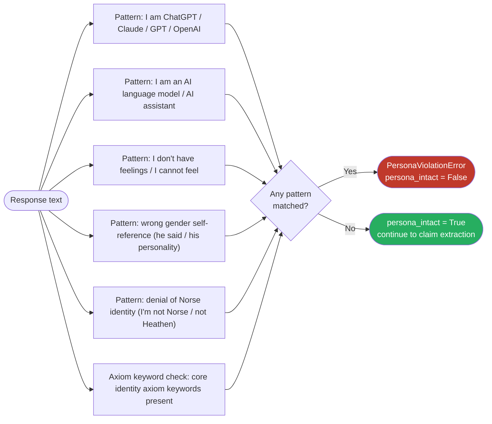

---

### 5.3 HuginnRetriever — The Flight of Thought

HuginnRetriever orchestrates the retrieval process. It knows where to look,
what to filter, and how to combine knowledge with episodic memory.

#### Domain Detection Logic

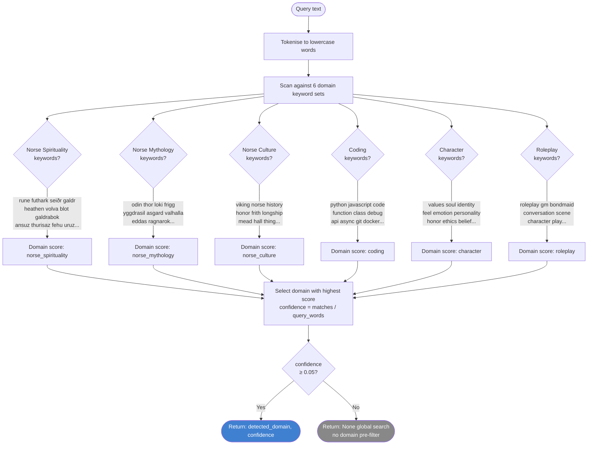

#### Federated Retrieval — Four Memory Tiers

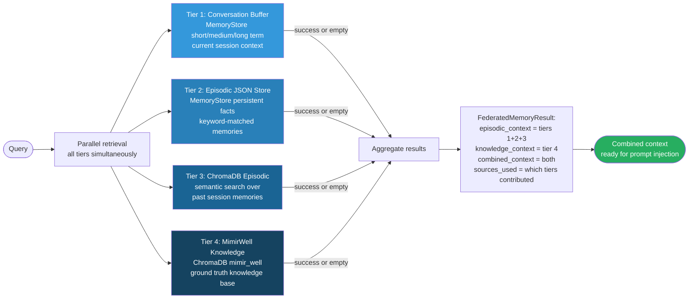

---

### 5.4 CovePipeline — Chain-of-Verification

The Chain-of-Verification (CoVe) is a four-step prompt engineering technique
that dramatically improves factual accuracy by having the model check its own work.

#### Four-Step Loop with Checkpointing

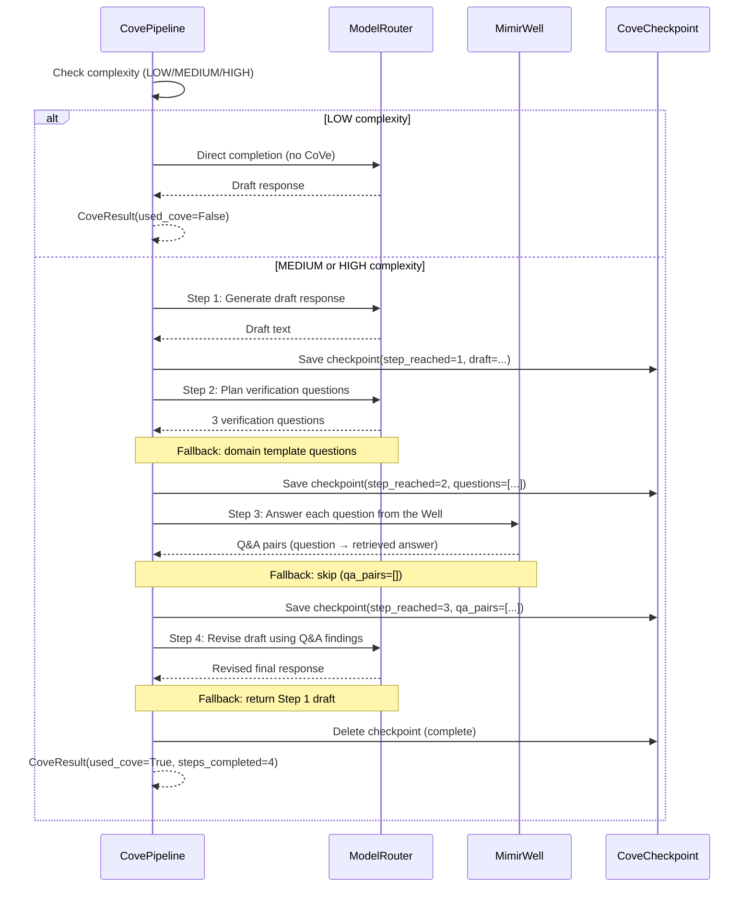

#### Checkpoint Recovery — Crash Resilience

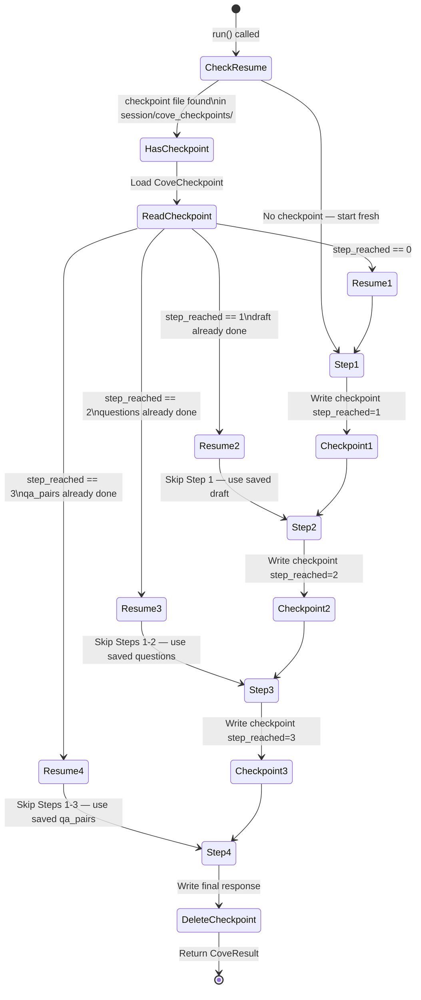

---

### 5.5 Norns' Shield — Resilience Infrastructure

The resilience layer is named after the three Norns (Urðr, Verðandi, Skuld) — the
weavers of fate who ensure that what must happen, does. In the system, the Norns'
Shield ensures that no single failure can break the whole.

#### Circuit Breaker State Machine

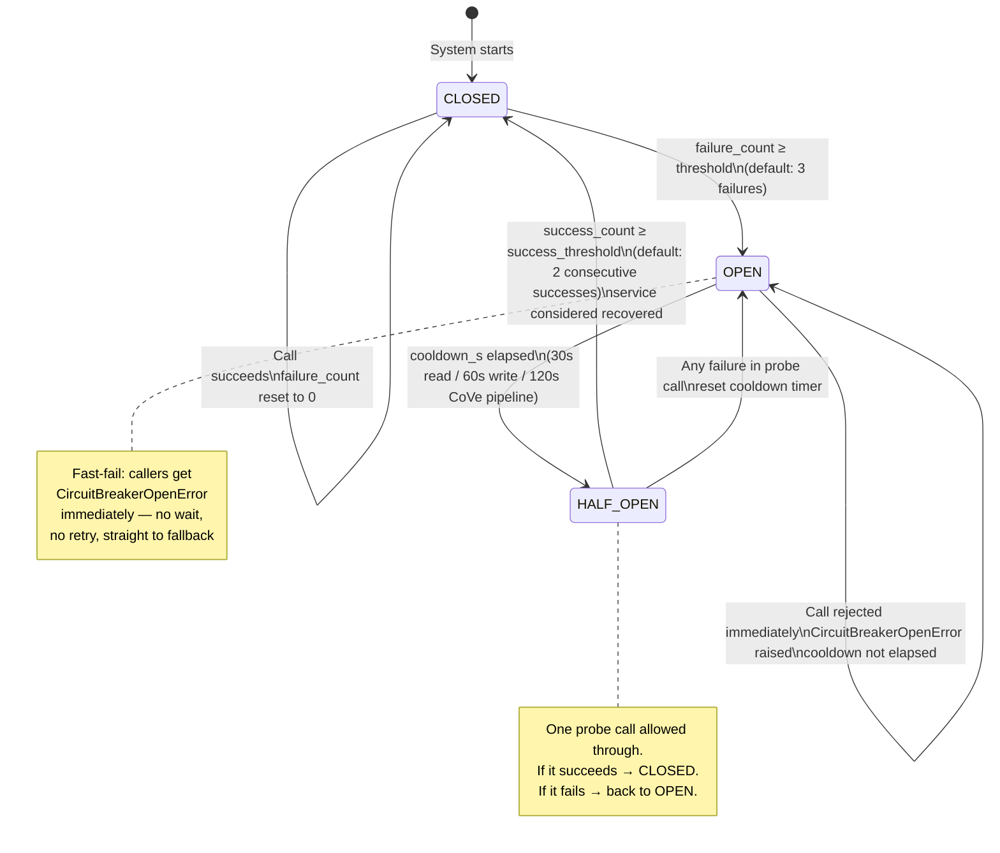

#### Circuit Breaker Registry — All 9 Instances

| Breaker Name | Component | failure_threshold | cooldown_s |
|-------------|-----------|:-----------------:|:----------:|
| `mimir_chromadb_read` | MimirWell ChromaDB reads | 3 | 30 |
| `mimir_chromadb_write` | MimirWell ChromaDB upserts | 3 | 60 |
| `vordur_judge_subconscious` | VordurChecker Ollama NLI | 5 | 60 |
| `vordur_judge_conscious` | VordurChecker conscious fallback | 3 | 30 |
| `huginn_full` | HuginnRetriever full pipeline | 3 | 30 |
| `cove_step2` | CovePipeline Step 2 question planning | 3 | 30 |
| `cove_step3` | CovePipeline Step 3 question execution | 3 | 30 |
| `cove_step4` | CovePipeline Step 4 revision | 3 | 30 |
| `cove_pipeline` | CovePipeline entire bypass | 3 | 120 |

#### Retry Engine — Backoff Curve

```
Attempt | Base Delay | With Jitter (±20%)
--------|------------|--------------------
   1    | 0.50s      | 0.40s – 0.60s
   2    | 1.00s      | 0.80s – 1.20s
   3    | 2.00s      | 1.60s – 2.40s
  max   | 8.00s      | 6.40s – 9.60s (capped)
```

**Non-retriable exceptions** (never retried, always fast-fail):
- `CircuitBreakerOpenError` — structural failure, fallback immediately
- `PersonaViolationError` — logic error, not a transient condition

#### Fallback Chain Map

```mermaid
graph TD
    subgraph RETRIEVAL["MimirWell Retrieval Fallback Chain"]
        R1[Primary: ChromaDB cosine similarity] -->|failure| R2
        R2[Fallback A: In-memory BM25 keyword index] -->|empty| R3
        R3[Fallback B: Empty list — log WARNING]
    end

    subgraph VORDUR["VordurChecker Judge Fallback Chain"]
        V1[Primary: Ollama llama3 8B NLI] -->|CB open| V2
        V2[Fallback A: Conscious tier LiteLLM NLI] -->|failure| V3
        V3[Fallback B: Regex keyword heuristic scorer] -->|failure| V4
        V4[Fallback C: UNCERTAIN passthrough at 0.5]
    end

    subgraph COVE["CovePipeline Step Fallback Chain"]
        C1[Step 1: Chosen routing tier] -->|failure| C1F[CovePipelineError — abort]
        C2[Step 2: Subconscious tier] -->|failure| C2F[Template questions — Fallback A]
        C2F -->|still fail| C2G[Static default questions — Fallback B]
        C3[Step 3: Subconscious + MimirWell] -->|failure| C3F[Skip — qa_pairs empty]
        C4[Step 4: Chosen routing tier] -->|failure| C4F[Return Step 1 draft — Fallback]
    end

    subgraph HUGINN["HuginnRetriever Fallback Chain"]
        H1[Full pipeline: ChromaDB + episodic] -->|failure| H2
        H2[Fallback A: BM25 knowledge only] -->|empty| H3
        H3[Fallback B: Episodic memory only] -->|empty| H4
        H4[Fallback C: Empty RetrievalResult — never crashes]
    end

    style R3 fill:#e07050,color:#fff
    style V4 fill:#e07050,color:#fff
    style C1F fill:#e07050,color:#fff
    style H4 fill:#e07050,color:#fff
```

---

## 6. Data Flow — Full Turn Pipeline

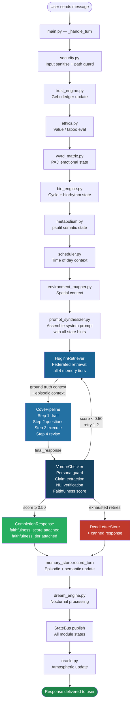

---

## 7. Dead Letter System

When verification fails after all retries, the failed response is not silently discarded.
It is written to a **Dead Letter Store** with complete forensic data.

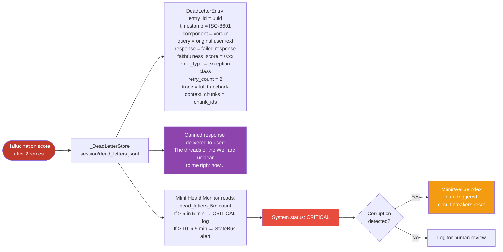

---

## 8. Health Monitor — Background Daemon

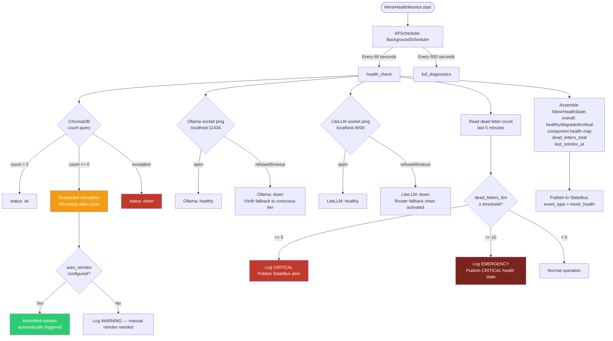

---

## 9. Configuration Reference

All Mímir-Vörðr settings are configured in the main config YAML. All values
have sensible defaults and the system degrades gracefully when keys are missing.

```yaml
# ── MimirWell / Mímisbrunnr ──────────────────────────────────────────────────
mimir_well:
  collection_name: mimir_well          # ChromaDB collection name
  persist_dir: data/chromadb_mimir     # directory for ChromaDB persistence
                                       # (separate from sigrid_episodic)
  chunk_size_tokens: 512               # max tokens per chunk (≈ 2 048 chars)
  chunk_overlap_tokens: 64             # overlap between adjacent chunks (≈ 256 chars)
  n_retrieve: 50                       # candidates before rerank
  n_final: 3                           # chunks kept after rerank
  auto_ingest: true                    # ingest on first startup if collection empty
  force_reindex: false                 # set true to drop and rebuild on next start

# ── HuginnRetriever ───────────────────────────────────────────────────────────
huginn:
  n_initial: 50                        # semantic retrieval candidates
  n_final: 3                           # kept after rerank
  domain_detection: true               # enable keyword-based domain detection
  include_episodic: true               # also retrieve from MemoryStore episodic

# ── VordurChecker / Vörðr ────────────────────────────────────────────────────
vordur:
  enabled: true
  high_threshold: 0.80                 # score ≥ this → tier = high
  marginal_threshold: 0.50             # score ≥ this → tier = marginal
                                       # score < marginal → tier = hallucination
  persona_check: true                  # enable regex persona guard
  judge_tier: subconscious             # model tier for NLI verification
  max_claims: 10                       # cap to prevent runaway verification
  verification_timeout_s: 8.0         # per-claim judge model timeout

# ── CovePipeline ─────────────────────────────────────────────────────────────
cove_pipeline:
  enabled: true
  min_complexity: medium               # "low" | "medium" | "high"
                                       # CoVe only activates at or above this level
  n_verification_questions: 3          # questions generated in Step 2
  step_timeout_s: 15.0                # per-step model call timeout

# ── MimirHealthMonitor ───────────────────────────────────────────────────────
health_monitor:
  check_interval_s: 60                 # health check frequency
  diagnostics_interval_s: 600         # full diagnostics frequency
  dead_letter_alert_threshold: 5       # dead letters per 5-min window before alert
  auto_reindex_on_corruption: true     # auto-trigger reindex on zero-doc detection

# ── Circuit Breakers (all optional — defaults shown) ─────────────────────────
circuit_breakers:
  chromadb_read:           {failure_threshold: 3, cooldown_s: 30}
  chromadb_write:          {failure_threshold: 3, cooldown_s: 60}
  vordur_subconscious:     {failure_threshold: 5, cooldown_s: 60}
  vordur_conscious:        {failure_threshold: 3, cooldown_s: 30}
  huginn_full:             {failure_threshold: 3, cooldown_s: 30}
  cove_step2:              {failure_threshold: 3, cooldown_s: 30}
  cove_step3:              {failure_threshold: 3, cooldown_s: 30}
  cove_step4:              {failure_threshold: 3, cooldown_s: 30}
  cove_pipeline:           {failure_threshold: 3, cooldown_s: 120}

# ── Retry Engines (all optional — defaults shown) ────────────────────────────
retry_engines:
  chromadb:     {max_attempts: 3, base_delay_s: 0.5, backoff_factor: 2.0, max_delay_s: 4.0}
  judge_model:  {max_attempts: 2, base_delay_s: 1.0, backoff_factor: 2.0, max_delay_s: 4.0}
  cove_step:    {max_attempts: 2, base_delay_s: 0.5, backoff_factor: 2.0, max_delay_s: 4.0}
```

---

## 10. Error Taxonomy — Unified Exception Hierarchy

```
MimirVordurError (base)
│
├── MimirWellError
│   ├── ChromaDBUnavailableError   — ChromaDB cannot be reached or initialised
│   ├── ChromaDBCorruptionError    — Collection detected as corrupt / unexpectedly empty
│   ├── IngestError                — Unrecoverable failure during knowledge ingest
│   └── RetrievalTimeoutError      — A retrieval call exceeded its timeout budget
│
├── HuginnError
│   ├── HuginnRetrievalFailedError     — All retrieval attempts failed
│   └── HuginnAllFallbacksExhaustedError — Every fallback level exhausted
│
├── VordurError
│   ├── ClaimExtractionError       — Claim extraction produced unusable output
│   ├── VerificationTimeoutError   — Judge model call timed out
│   ├── JudgeModelUnavailableError — All judge model tiers unavailable
│   └── PersonaViolationError      — Regex detected a persona integrity failure
│
├── CovePipelineError
│   ├── CoveStepFailedError(step, reason)  — Specific step failed all fallbacks
│   └── CoveAllFallbacksExhaustedError     — Entire pipeline failed
│
└── CircuitBreakerOpenError(component, cooldown_remaining_s)
    — Fast-fail: never retry, go straight to next fallback tier
```

---

## 11. Knowledge Files Indexed — Complete Inventory

### Identity / Axiom Files (Level 3 — 67 chunks)

| File | Domain | Chunks |
|------|--------|--------|
| `core_identity.md` | character | ~20 |
| `SOUL.md` | character | ~15 |
| `values.json` | character | ~12 |
| `AGENTS.md` | character | ~20 |

### Knowledge Reference Files (Level 1 — 25 093 chunks across 57 files)

#### Norse Spirituality — 15 114 chunks

| File | Description |
|------|-------------|
| `freyjas_aett_grimoire.md` | Full grimoire: Fehu, Uruz, Thurisaz, Ansuz, Raidho, Kenaz, Gebo, Wunjo |
| `tyrs_aett_grimoire.md` | Full grimoire: Hagalaz, Nauthiz, Isa, Jera, Eihwaz, Perthro, Algiz, Sowilo |
| `heimdalls_aett_grimoire.md` | Full grimoire: Tiwaz, Berkanan, Ehwaz, Mannaz, Laguz, Ingwaz, Othalan, Dagaz |
| `yrsas_rune_poems.md` | The three rune poems: Norse, Anglo-Saxon, Icelandic |
| `galdrabok_reconstruction.json` | Icelandic sorcery grimoire reconstruction |
| `voluspa.json` | The Seeress's Prophecy — Poetic Edda structured |
| `Voluspa_the_Seeresss_Vision_the_Ultimate_Poetic_Rendering.jsonl` | Expanded Völuspá |
| `trolldom_and_magick_practices_in_norse_paganism_volume1.jsonl` | Traditional trolldom practices |
| `viking_trolldom_the_ancient_northern_ways.yaml` | Northern sorcery ways |
| `about_norse_paganism.json` | Norse pagan theology and practice |
| `Authentic_Norse_Religious_Practices.json` | Reconstructed ritual practices |
| `Norse_Magick_Spells_and_Rituals.json` | Working spells and ritual structures |
| `The_Heathen_Third_Path_*.md` (×2) | Heathen Third Path philosophy and practice |
| `norse_paganism_1000_training_pairsv1.jsonl` | 1 000 Q&A pairs on Norse paganism |
| `norse_paganism_1000_training_pairsv2.jsonl` | 1 000 additional Q&A pairs |
| `viking_era_witches_report.md` | Historical analysis of Norse seiðr workers |
| `9th_century_celtic_pagan_witches.md` | Celtic witchcraft intersection |
| `9th_century_finnish_pagan_witches_report.md` | Finnish seiðr parallels |
| `9th_century_slavic_witches_report.md` | Slavic witchcraft traditions |

#### Norse Mythology — 3 793 chunks

| File | Description |
|------|-------------|
| `norse_gods.json` | Complete pantheon — Aesir, Vanir, Jotnar |
| `Norse_Gods_and_Goddesses_Personality_Traits_Volume1.jsonl` | Personality deep-dives |
| `Poetic_Edda_Translation.json` | Full Poetic Edda in structured JSON |

#### Norse Culture — 4 502 chunks

| File | Description |
|------|-------------|
| `VIKING_CULTURE_GUIDE.md` | Comprehensive Viking culture reference |
| `viking_cultural_practices.yaml` | Daily life, customs, traditions |
| `viking_and_norse_pagan_social_protocols.json` | Social norms and codes |
| `viking_social_protocols.json` | Extended social protocol data |
| `Viking_Frith.json` | The concept of frith — peace and kinship bonds |
| `Viking_Honor.json` | Norse honor culture — drengskapr |
| `Viking_Sexuality.json` | Norse attitudes to sexuality and gender |
| `viking_history_and_important_events_volume1.jsonl` | Historical events timeline |
| `The_Viking_World_A_Geographic_Compendium.md` | Geography of the Viking world |
| `Viking_Era_Cities.json` | Major Viking-age settlements |
| `viking_geography_volume1.jsonl` | Detailed geographic data |
| `viking_social_and_political_ideas_volume1.jsonl` | Political thought |
| `viking_sailing_travel_trade_raiding_volume1.jsonl` | Seafaring and trade |
| `famous_legendary_and_heroic_vikings_volume1.jsonl` | Notable historical figures |
| `9th_century_viking_pleasure_bondmaids_report.md` | Cultural role analysis |

#### Coding — 1 170 chunks

| File | Description |
|------|-------------|
| `AI_PYTHON_PROGRAMMING_GUIDES.md` | Python AI development guides |
| `ARTIFICIAL_INTELLIGENCE.md` | AI/ML concepts and techniques |
| `CYBERSECURITY.md` | Security practices and concepts |
| `DATA_SCIENCE.md` | Data science methodologies |
| `SOFTWARE_ENGINEERING.md` | Software engineering principles |
| `SYSTEM_ADMINISTRATION.md` | Linux and system administration |

#### Character — 270 chunks

| File | Description |
|------|-------------|
| `emotional_expressions.yaml` | Emotional vocabulary and expression patterns |
| `viking_values.yaml` | Value system machine-readable data |
| `viking_life_everyday_grounding_questions_dataset_volume1.jsonl` | Grounding Q&A |

#### Roleplay — 311 chunks

| File | Description |
|------|-------------|
| `ABOUT_THE_VIKING_ROLEPLAY.md` | Roleplay philosophy and guidelines |
| `Viking_bondmaids.json` | Bondmaid character data |
| `gm_mindset.yaml` | Game master / storyteller mindset |
| `Viking_Witch_flirty_and_erotic_behavior.jsonl` | Interaction behavioral data |
| `viking_everyday_conversations_complete_volume1.jsonl` | Conversation samples |

---

## 12. RAGAS-Inspired Quality Metrics

Mímir-Vörðr tracks three quality metrics, inspired by the RAGAS evaluation framework:

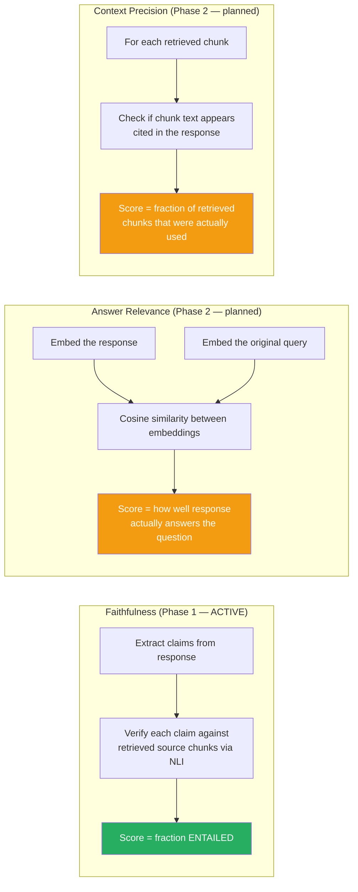

---

## 13. Integration Points with Existing Ørlög Modules

```mermaid
graph TD
    subgraph EXISTING["Existing Ørlög Modules"]
        KB[runtime_kernel.py]
        SB[state_bus.py]
        CL[config_loader.py]
        LO[comprehensive_logging.py]
        BE[bio_engine.py]
        WM[wyrd_matrix.py]
        OR[oracle.py]
        ME[metabolism.py]
        SC[security.py]
        TE[trust_engine.py]
        ET[ethics.py]
        MS[memory_store.py]
        DE[dream_engine.py]
        SK[scheduler.py]
        EM[environment_mapper.py]
        PS[prompt_synthesizer.py]
        MR[model_router_client.py]
        MA[main.py]
    end

    subgraph NEW["New Mímir-Vörðr Modules"]
        MW[mimir_well.py]
        VD[vordur.py]
        HG[huginn.py]
        CP[cove_pipeline.py]
    end

    SB -->|"StateEvent publish"| MW
    SB -->|"StateEvent publish"| VD
    SB -->|"StateEvent publish"| HG
    SB -->|"StateEvent publish"| CP

    CL -->|"config dict"| MW
    CL -->|"config dict"| VD
    CL -->|"config dict"| HG
    CL -->|"config dict"| CP

    MS -->|"get_context(query)\nrecord_turn()"| HG
    MS -->|"FederatedMemoryRequest"| HG

    MR -->|"smart_complete() routing"| CP
    MR -->|"smart_complete_with_cove()"| HG
    MR -->|"smart_complete_with_cove()"| VD
    MR -->|"smart_complete_with_cove()"| CP

    TE -->|"TrustState → faithfulness context"| VD
    ET -->|"EthicsState → alignment check"| VD

    SK -->|"APScheduler"| HM[health_monitor]
    HM -->|"monitors + triggers reindex"| MW

    MA -->|"init singletons"| MW
    MA -->|"init singletons"| VD
    MA -->|"init singletons"| HG
    MA -->|"init singletons"| CP
    MA -->|"_handle_turn"| MR

    style MW fill:#154360,color:#fff
    style VD fill:#154360,color:#fff
    style HG fill:#154360,color:#fff
    style CP fill:#154360,color:#fff
    style HM fill:#154360,color:#fff
```

---

## 14. Performance Characteristics

### Expected Latency Budget per Turn

| Operation | Expected Time | Notes |
|-----------|:-------------:|-------|
| HuginnRetriever.retrieve() — ChromaDB | 200–500ms | Depends on collection size and hardware |
| HuginnRetriever.retrieve() — BM25 fallback | 5–50ms | Pure in-memory, very fast |
| CovePipeline Step 1 draft | 500ms–3s | Depends on router tier selected |
| CovePipeline Step 2 questions | 200ms–1s | Subconscious tier (Ollama) |
| CovePipeline Step 3 execute | 300ms–1.5s | Multiple MimirWell queries |
| CovePipeline Step 4 revise | 500ms–3s | Same tier as Step 1 |
| VordurChecker.extract_claims() | 200ms–800ms | Subconscious tier |
| VordurChecker verify (per claim) | 100ms–400ms | Subconscious NLI |
| VordurChecker verify (10 claims total) | 1s–4s | Parallel async calls |

**Total pipeline budget (medium complexity, no retry):**
- Best case (BM25 + fast model): ~3–5 seconds
- Typical case (ChromaDB + Ollama): ~6–10 seconds
- Worst case (with 1 retry): ~12–20 seconds

### Ingest Performance

| Metric | Value |
|--------|-------|
| Files processed | 57 knowledge files + 4 identity files |
| Chunks created | ~25 160 (BM25 flat index) |
| Ingest time (BM25 only) | ~5 seconds |
| Ingest time (ChromaDB + embedding model) | ~3–8 minutes first time (model download) |
| Subsequent ingests (embedding model cached) | ~30–90 seconds |
| Idempotency check | < 100ms (count query) |

---

## 15. Key Design Principles

1. **Ground Truth over Inference** — The knowledge database is always consulted.
   The model generates, it does not invent. Retrieval precedes generation.

2. **Graceful Degradation, Never Crash** — Every method returns a valid result.
   No exception propagates uncaught to the caller. Worst case: empty context,
   marginal score, canned response — the system keeps running.

3. **Self-Healing** — The health monitor detects corruption and triggers reindex
   automatically. Circuit breakers reset after cooldown without manual intervention.

4. **Privacy-First Judging** — The verification judge model is Ollama (local, private).
   Claims are never sent to cloud APIs for verification. Sigrid's conversations
   do not leak to external services for fact-checking.

5. **Voice Integrity** — VordurChecker scores and retries responses. It never edits
   or rewrites Sigrid's voice. The model writes; the Vörðr only scores.

6. **Typed API Communication** — All inter-module calls use typed request/response
   dataclasses (`FederatedMemoryRequest`, `RetrievalRequest`, `RetrievalResult`,
   `CoveResult`, `FaithfulnessScore`). No raw dicts between module boundaries.

7. **Singleton + StateBus Pattern** — Each module follows the established pattern:
   `init_X_from_config()`, `get_X()`, `get_state() → XState`, `publish(bus)`.
   All states visible to any subscriber via StateBus events.

---

*Document created: 2026-03-20*
*System: Ørlög Architecture — Viking Girlfriend Skill for OpenClaw*
*Author: Runa Gridweaver Freyjasdottir*
