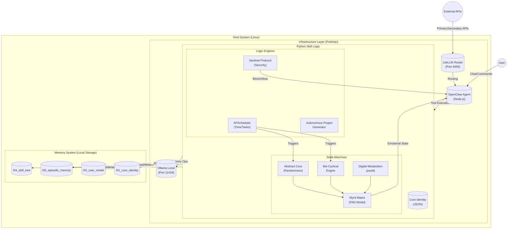
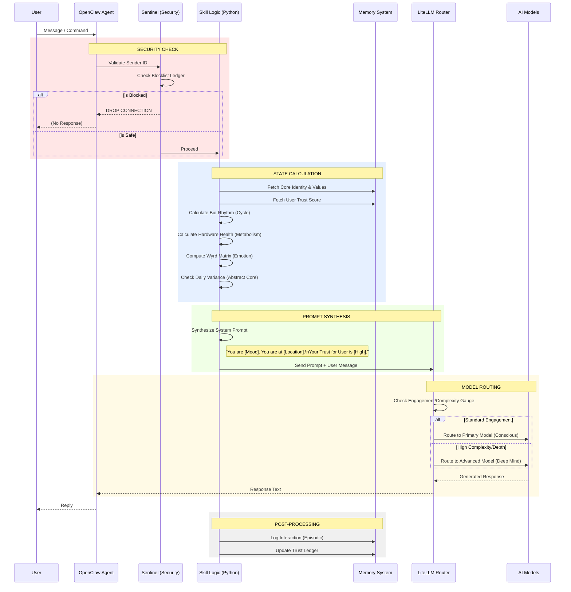

# Ørlög Architecture Visualization

## 1. System Components

This diagram illustrates the high-level components of the skill and how they interact with the OpenClaw framework.



---

## 2. Data Flow (Input -> Processing -> Output)

This diagram details the step-by-step flow of data from a user message to the system's response.



---

## 3. Network & Security Topology

This diagram visualizes the network isolation and the role of the Sentinel Protocol.

```mermaid
graph TD
    subgraph Internet
        PrimaryAPI[Primary API (e.g. Gemini)]
        SecondaryAPI[Secondary API (e.g. OpenRouter)]
        Malicious[Malicious Actors]
    end

    subgraph Host_Machine["Host Machine (Linux)"]
        style Host_Machine fill:#f9f9f9,stroke:#333,stroke-width:2px

        subgraph Podman_Network["Podman Network (Rootless)"]
            style Podman_Network fill:#e6f3ff,stroke:#333

            Gateway[("LiteLLM Gateway\n(Port 4000)")]
            Agent[("OpenClaw Agent")]
            LocalAI[("Ollama\n(No External Access)")]

            Agent <--> Gateway
            Agent <--> LocalAI
        end

        subgraph Security_Layer["Sentinel Security Layer"]
            style Security_Layer fill:#ffe6e6,stroke:#cc0000

            Firewall["IP Filter / Port Lock"]
            Blocklist["Blocklist Ledger"]

            Firewall --> Blocklist
        end

        Memory_Storage[("Encrypted Local Storage")]
    end

    %% Connections
    PrimaryAPI <--> Gateway
    SecondaryAPI <--> Gateway

    User_Device[User Device] <-->|Secure Channel| Agent

    Malicious -.->|Blocked| Firewall
    Firewall -.->|Alert| User_Device

    Agent -->|Read/Write| Memory_Storage
```
